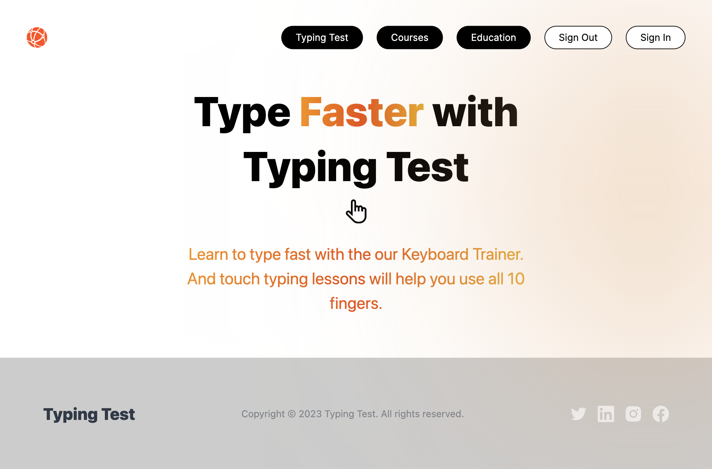

<h1 align='center'>Typing Test App</h1>


 




<p>Большое спасибо за интересное тестовое задание компании NewGen Vision</p>
Проект можно посмотреть перейдя по ссылке ниже

[Deploy by Vercel](https://typing-test-jet.vercel.app/)

This is a [Next.js](https://nextjs.org/) project bootstrapped with [`create-next-app`](https://github.com/vercel/next.js/tree/canary/packages/create-next-app).

## Getting Started

1. Install dependencies
```bash
npm install
```

2. Run the development server:

```bash
npm run dev
```

Open [http://localhost:3000](http://localhost:3000) with your browser to see the result.


## Требования к Web-приложению:
- получение текста через публичные API (например https://baconipsum.com/json-api/);
- отображение набираемого текста в реальном времени;
- демонстрация скорости печати;
- реакция на ввод неверных символов;
- подсчет точности вводимой информации.

## Реализовано дополнительно:
- выбор сложности текста для тестирования;
- переход между страницами;
- немного анимации;

